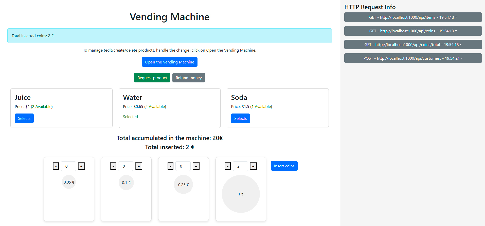
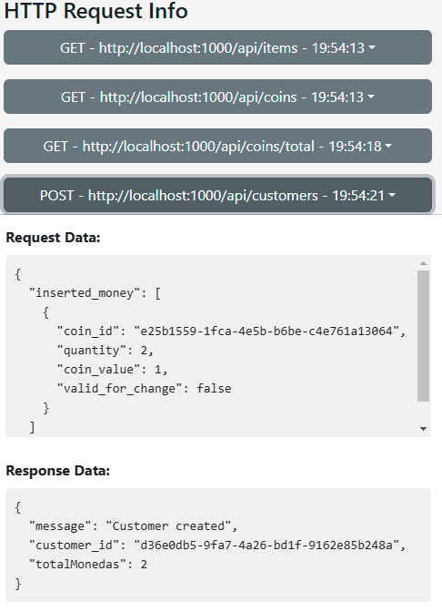
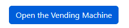
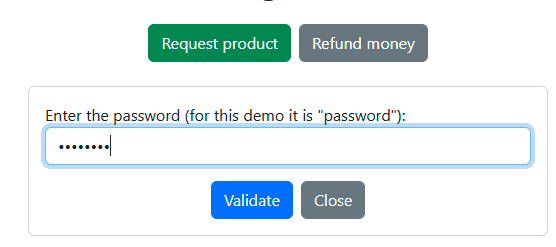
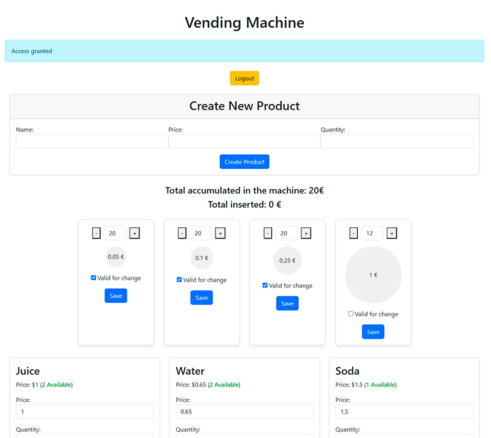

# ⛾ Watteria Vending Machine

Este repositorio contiene la prueba que me han pedido Anna y Julio de una máquina de vending.

### ⚠ Importante
- Lo he hecho aplicando **DDD, CQRS y TDD.**
- Creé un frontend en **React** para facilitar las pruebas ya que comentastes que lo usais para front ***(abajo os pongo links de todo)***.
- En el frontend, la **máquina** se muestra a la izquierda y las **peticiones/respuestas de la API** a la derecha. Asi veis todo lo que pasa front/back en una sola pantalla.
- Inicialmente usé MySQL porque es lo que estoy acostumbrado, pero al final como tenia aún tiempo  migré a MongoDB que me comentaste también es lo que usais.
- Teneis un makefile desde el que podeis instalar,iniciar todo, hacer test... Lo he probado en windows y mac (uno viejo que tengo) si no os va, decirme porque tendria que ser make install , make init , todo deberia funcionar y ser Fanta y diversión 


### ⚠ Requisitos
- Docker
- Composer
- Node
- Make: Para utilizar un Makefile, necesitas tener "make" instalado. En Windows, deberás instalar GnuWin32. Los espacios y ciertos caracteres en el nombre de la ruta pueden causar problemas al ejecutar make, por lo que se recomienda instalarlo en `C:\GnuWin32`. Puedes descargarlo desde [aquí](https://gnuwin32.sourceforge.net/packages/make.htm).


### 🛈 Instalación:
- `make install` para iniciar los contenedores, instalar dependencias, base de datos, cache, ...y poner datos iniciales ( tarda endre 6 - 8 min.)

### 🛈 Ejecucion:
- `make init` se reinicia todo y restaura la base de datos

### 🛈 Útiles:
- **Cerrar Todo:** Ejecuta `make down` para hacer down de contendores.
- **Recrear Base de datos:** Ejecuta `make recreate-db` para volver a  crear la estructura de la base de datos y poner datos iniciales.


### ☑ Pruebas:
- **Pruebas unitarias:** `make test-unit`
- **Pruebas de aceptación:**`make test-acceptance-behat`


### 🖳 Contenido:
- Contenedor NGINX 1.19 para el back.
- Contenedor PHP 8.2 para alojar la aplicación Symfony.
- Contenedor NGINX 1.19 para el front en REACT.
- ~~Contenedor MySQL 8.0 para almacenar las bases de datos.~~
- Contenedor MongoDB para almacenar los datos.
- Contenedor RabbitMQ 3 para gestionar mensajes asíncronos.
- Contenedor Supervisor para crear workers y manejar mensajes asíncronos con llamadas a command consumidor configurado en /docker/supervisor/workers.conf .
- Contenedor MongoDB Express para tener entorno UI de la Base de datos.


### 🖧 Links:
- Frontend (React): http://localhost:1002/
- Backend (Symfony): http://localhost:1000/
- RabbitMq ( Domain event Bus) : http://localhost:15672/ ( user: guest , pass: guest )
- MongoDB Express UI : http://localhost:8081/db/database ( user: admin , pass: pass )


# Frontend - Reactjs
http://localhost:1002

- Hay dos zonas en el front end, la izquierda simula la máquina y la derecha muestra las peticiones al backend
  </img>
- En la parte izquierda vereis que se van acumulando las peticiones, si clicas sobre cada una vereis el detalle de la url, method,  request i response de cada una

  </img>

- En la simulación de la máquina puedes "abrir" la máquina mediante el password "password" y alli añadir productos, actualizarlos y añadir monedas asi como definir quales son válidas para cambio
  
  </img>

  </img>

  </img>

# DDD / CQRS

## Estrutura de directorios
### Estructura de Bounded Context / Módulos

```plaintext
src/
├── Context/
│   ├── Coins/
│   │   ├── Coin/
│   │   ├── Event/
│   ├── Customers/
│   │   ├── Customer/
│   │   ├── Event/
│   ├── Items/
│       ├── Event/
│       ├── Item/
├── SharedKernel/
```

### Estructura de  un Módulo ( más o menos se repite la idea en Customers y Items)

```plaintext
Coins/
├── Coin/
│   ├── Application/
│   │   ├── AllCoins/
│   │   │   ├── AllCoinsQuery.php  🔷Query
│   │   │   ├── AllCoinsQueryHandler.php 🔷Query Bus Handler
│   │   │   ├── AllCoinsResponse.php 🔷Query Bus Response
│   │   │   └── AllCoinsUseCase.php 🔷 Caso de uso 
│   │   ├── OnCustomerCheckout/
│   │   │   └── OnCustomerCheckout.php 🦻Subscripcion a evento
│   │   ├── TotalAmount/ 🧿 misma estructura que allcoins
│   │   ├── UpdateCoin/
│   │       ├── UpdateCoinCommand.php 🔶Command
│   │       ├── UpdateCoinCommandHandler.php  🔶Command Bus Handler
│   │       └── UpdateCoinUseCase.php 🔶 Caso de uso 
│   ├── Domain/
│   │   ├── Event/
│   │   │   └── CoinWasUpdated.php 🛜 Domain Event
│   │   ├── Repository/
│   │   │   └── CoinRepository.php 📂 Coin Repository
│   │   ├── Tools/
│   │   │   ├── MoneyChangeOnLimitedCoins.php 🧿 Servicio gestion de cambio
│   │   │   └── MoneyCounterFromJson.php 🧿 Servicio contador de monedas
│   │   ├── ValueObject/
│   │   │   └── CoinId.php.... 💲Value Objects
│   │   └── Coin.php 📦Agregate Root
│   ├── Infrastructure/
│   │   ├── Persistence/
│   │   │   └── Doctrine/
│   │   │       ├── Fixture/
│   │   │       │   └── CoinFixture.php ☑️ Fixture para test con behat
│   │   │       ├── mapping/
│   │   │       │   └── Coin.Domain.Coin.orm.xml 🧿 Definicion en doctrine
│   │   │       │   └── CoinIdType.php.... 🧿 Definicion de type de  doctrine
│   │   │       ├── mongo_mapping/
│   │   │       │   └── Coin.mongodb.xml 🧿 Definicion para el mapping de MongoDb
│   │   │       ├── MongoDocumentCoinRepository.php 🧿 Repository en mongo
│   │   │       └── MysqlDoctrineCoinRepository.php 🧿 Repository en mysql
│   │   ├── Symfony/
│   │   │   └── routes.yaml 🖧 Rutas de symfony
│   ├── UI/📥 User Interface
│       ├── Controller/ 📥 Controladores
│           ├── AllCoinsController.php 
│           ├── AvaiableChangeCoinsController.php
│           ├── TotalAmountController.php
│           └── UpdateCoinController.php
├── Event/
├── CoinsCommand.php 🔶Command Bus
├── CoinsDomainEvent.php 🛜 Domain Event
└── CoinsQuery.php 🔷Query Bus
```
### Estructura del Shared Kernel

```plaintext
SharedKernel/
├── Domain/ 🧿 Estructura para que funcionen Agregate, los buses de command/query, los eventos de dominio
├── Infrastructure/ 🧿 Estructura para que funcionen los buses,los controladores, el Rabbit
├── UI/
├── Command/
│   ├── ConfigureRabbitMqCommand.php 🧿 comando para que al arrancar configure los exchange si no existen
│   ├── ConsumeRabbitMqDomainEventsCommand.php 🧿 Consumidor de Rabbit
│   └── GenerateSupervisorRabbitMqConsumerFilesCommand.php 🧿 Ayuda a crear la config que esta en /docker/supervisor
├── Controller/
├── PasswordValidatorController.php 🧿 servicio que comprueva el password
```

### Estructura de Test

```plaintext

tests/
├── Acceptance/ 🧿 Behat
├── Unit/ 🧿 PhpUnit

```
- **Pruebas unitarias:** `make test-unit`
- **Pruebas de aceptación:**`make test-acceptance-behat`

## Domain Event
- Solo hay un evento al que estan suscritos tanto items como coins que es CustomerWasCheckout
- Este ocurre cuando el usuario ha pedido el producto y se ha cumplido todo para que lo reciba
- **Coins**: Actualiza las monedas que quedan en la máquina, despues de sumar lo insertdo por usuario y devolver el cambio
- **Items**: Resta 1 a la cantidad de producto
- Estos dos procesos se encolan en rabbit y el contenedor supervisor hace de cron para consumir los eventos

## RabbitMq

### Connection
```plaintext
- http://localhost:15672/
- user: guest
- pass: guest
```


### Exchanges
- ***domain_events_vending:*** exchange inicial
- ***retry-domain_events_vending:*** exchange en caso de fallida inicial, lo intenta 5 veces ( .env -> RABBITMQ_MAX_RETRIES )
- ***dead_letter-domain_events_vending:*** exchange si ha intentado 5 veces y ni por esas, se queda aqui y nadie lo consume

### Colas
#### Coins

- ***coins.coin.application.on_customer_checkout:*** cola de coin cuando se lanza el evento 	customer.checkout
- ***retry.coins.coin.application.on_customer_checkout:*** si falla lo intenta 5 veces en esta cola
- ***dead_letter.coins.coin.application.on_customer_checkout:*** si falla se queda en esta cola

#### Items

- ***items.item.application.on_customer_checkout:*** cola de item cuando se lanza el evento 	customer.checkout
- ***retry.items.item.application.on_customer_checkout:*** si falla lo intenta 5 veces en esta cola
- ***dead_letter.items.item.application.on_customer_checkout:*** si falla se queda en esta cola


# Detalle de Rutas/Peticiones definidas a la API:

## Coins
### Get all coins
Url: http://localhost:1000/api/coins \
Method: GET \
Response:
```JSON
[{
"coin_id": "e48b2473-8562-432e-8305-4293be72056d",
"quantity": 20,
"coin_value": 0.1,
"valid_for_change": true
},
{
"coin_id": "3991b21f-3d6f-43bd-899c-a53bc5d2da13",
"quantity": 20,
"coin_value": 0.25,
"valid_for_change": false
}
]
```
### Avaiable coins for change
Url: http://localhost:1000/api/avaiable_change \
Method: GET \
Response:
```JSON
[{
"coin_id": "e48b2473-8562-432e-8305-4293be72056d",
"quantity": 20,
"coin_value": 0.1,
"valid_for_change": true
},
{
"coin_id": "3991b21f-3d6f-43bd-899c-a53bc5d2da13",
"quantity": 20,
"coin_value": 0.25,
"valid_for_change": false
}
]
```

### All amount coins
Url: http://localhost:1000/api/total \
Method: GET \
Response:
```JSON
{
  "total": 20
}
```

### Update coin

Url: http://localhost:1000/api/coins/{coin_id} \
Method: POST\
Request:
```JSON
{
  "coin_id": "e25b1559-1fca-4e5b-b6be-c4e761a13064",
  "quantity": 13,
  "coin_value": 1,
  "valid_for_change": false
}
``` 
Response:
```JSON
{
  "message": "Coin updated"
}
``` 


## Items
### Get all items
Url: http://localhost:1000/api/items \
Method: GET  \
Response:
```JSON
[{
  "item_id": "996a0505-d0ee-4eaf-ae30-acbd76781be2",
  "product_name": "Juice",
  "quantity": 2,
  "price": 1
},
{
  "item_id": "306942d8-a757-4cc6-92d2-28c9b13b5dd8",
  "product_name": "Water",
  "quantity": 3,
  "price": 0.65
},
{
  "item_id": "7ea894a0-9ee5-47a5-b85c-85fd05a8ddf9",
  "product_name": "Soda",
  "quantity": 1,
  "price": 1.5
}
]
```

### Avaiable items
Url: http://localhost:1000/api/items/avaiable_items \
Method: GET \
Response:
```JSON
[{
  "item_id": "996a0505-d0ee-4eaf-ae30-acbd76781be2",
  "product_name": "Juice",
  "quantity": 2,
  "price": 1
},
{
  "item_id": "306942d8-a757-4cc6-92d2-28c9b13b5dd8",
  "product_name": "Water",
  "quantity": 3,
  "price": 0.65
}
]
```


### Create item
Url: http://localhost:1000/api/items \
Method: POST \
Request:
```JSON
{
  "newItem": {
    "product_name": "PRODUCTO",
    "price": "23",
    "quantity": "23"
  }
}
```
Response:
```JSON
{
  "message": "Item created"
}
```


### Update item
Url: http://localhost:1000/api/items/{item_id} \
Method: POST \
Request:
```JSON
{
  "updatedItem": {
    "item_id": "7ea894a0-9ee5-47a5-b85c-85fd05a8ddf9",
    "product_name": "Soda",
    "quantity": "2",
    "price": 1.5
  }
}
```
Response:
```JSON
{
  "message": "Item updated"
}
``` 

### Delete item
Url: http://localhost:1000/api/items/{item_id} \
Method: DELETE \
Response:
```JSON
{
  "message": "Item deleted"
}
``` 


## Customers
### View customer
Url: http://localhost:1000/api/customers/{customer_id} \
Method: GET \
Response:
```JSON
{
  "message": "Item deleted"
}
``` 

##### View customer inserted money

    http://localhost:1000/api/customers/inserted_money/{customer_id}
        Method: GET    
        Response: 

### Create Customer
Url: http://localhost:1000/api/customers \
Method: POST \
Request:
```JSON
{
  "inserted_money": [
    {
      "coin_id": "e25b1559-1fca-4e5b-b6be-c4e761a13064",
      "quantity": 1,
      "coin_value": 1,
      "valid_for_change": false
    }
  ]
}
```
Response:
```JSON
{
  "message": "Customer created",
  "customer_id": "ad6ce13b-69f2-4031-b18f-188b6a160cb5",
  "totalMonedas": 1
}
```
### Update Customer
Url: http://localhost:1000/api/customers/{customer_id} \
Method: POST \
Request:
```JSON
{
  "inserted_money": [
    {
      "coin_id": "3991b21f-3d6f-43bd-899c-a53bc5d2da13",
      "quantity": 1,
      "coin_value": 0.25,
      "valid_for_change": true
    },
    {
      "coin_id": "e25b1559-1fca-4e5b-b6be-c4e761a13064",
      "quantity": 1,
      "coin_value": 1,
      "valid_for_change": false
    }
  ],
  "id_product": "996a0505-d0ee-4eaf-ae30-acbd76781be2"
}
```
Response:
```JSON
{
  "message": "Customer updated",
  "totalMonedas": 1.25
}
``` 

### Checkout Customer without token
Url: http://localhost:1000/api/customers/checkout/ \
Method: POST \
Request:
```JSON
{
  "inserted_money": [
    {
      "coin_id": "e25b1559-1fca-4e5b-b6be-c4e761a13064",
      "quantity": 6,
      "coin_value": 1,
      "valid_for_change": false
    }
  ],
  "id_product": "996a0505-d0ee-4eaf-ae30-acbd76781be2"
}
```
Response:
```JSON
{
  "status": "return",
  "change_to_return": [
    {
      "coin_id": "3991b21f-3d6f-43bd-899c-a53bc5d2da13",
      "coin_value": 0.25,
      "quantity": 20
    }
  ],
  "coins_on_machine": [
    {
      "coin_id": "e48b2473-8562-432e-8305-4293be72056d",
      "quantity": 20,
      "coin_value": 0.1,
      "valid_for_change": true
    },
    {
      "coin_id": "3991b21f-3d6f-43bd-899c-a53bc5d2da13",
      "quantity": 0,
      "coin_value": 0.25,
      "valid_for_change": true
    }
  ],
  "machine_total": 2
}
```

### Checkout Customer
Url: http://localhost:1000/api/customers/checkout/{customer_id} \
Method: POST \
Request:
```JSON
{
  "inserted_money": [
    {
      "coin_id": "e25b1559-1fca-4e5b-b6be-c4e761a13064",
      "quantity": 6,
      "coin_value": 1,
      "valid_for_change": false
    }
  ],
  "id_product": "996a0505-d0ee-4eaf-ae30-acbd76781be2"
}
```
Response:
```JSON
{
  "status": "return",
  "change_to_return": [
    {
      "coin_id": "3991b21f-3d6f-43bd-899c-a53bc5d2da13",
      "coin_value": 0.25,
      "quantity": 20
    }
  ],
  "coins_on_machine": [
    {
      "coin_id": "e48b2473-8562-432e-8305-4293be72056d",
      "quantity": 20,
      "coin_value": 0.1,
      "valid_for_change": true
    },
    {
      "coin_id": "3991b21f-3d6f-43bd-899c-a53bc5d2da13",
      "quantity": 0,
      "coin_value": 0.25,
      "valid_for_change": true
    }
  ],
  "machine_total": 2
}
```


### Reset Customer without token
Url: http://localhost:1000/api/customers/reset/ \
Method: POST \
Request:
```JSON
{
  "inserted_money": ""
}
```
Response:
```JSON
{
  "message": "Customer reset. Nothing to return."
}
```


### Reset Customer with token
Url: http://localhost:1000/api/customers/reset/{customer_id} \
Method: POST \
Request:
```JSON
{
  "inserted_money": [
    {
      "coin_id": "e25b1559-1fca-4e5b-b6be-c4e761a13064",
      "quantity": 2,
      "coin_value": 1,
      "valid_for_change": false
    }
  ]
}
```
Response:
```JSON
{
  "inserted_money": [
    {
      "coin_id": "e25b1559-1fca-4e5b-b6be-c4e761a13064",
      "quantity": 2,
      "coin_value": 1,
      "valid_for_change": false
    }
  ]
}
```


### Password verify
Url: http://localhost:1000/api/password-verify \
Method: POST\
Request:
```JSON
{
  "password": "password"
}
``` 
Response:
```JSON
{
  "accesoPermitido": true
}
``` 


Si has llegado hasta aquí , ***¡OLE TU!*** porque vaya turra te he dado.
